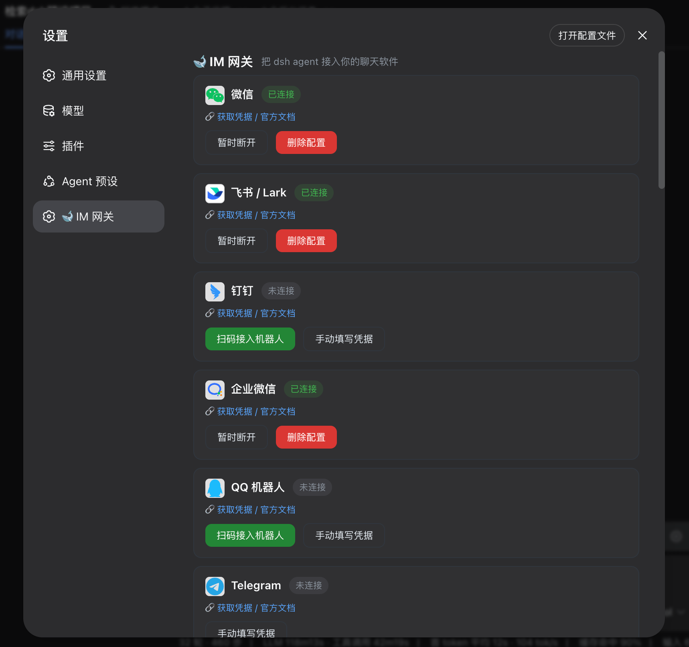

# 🐋 dsh-im-gateway

<h3 align="center">把 DeepSeek Harness 接入你常用的每一个聊天软件</h3>
<p align="center">Aggregated IM gateway for <b>DeepSeek Harness (dsh)</b> — drive your coding agents from <b>WeChat, Feishu, Telegram, Discord, QQ</b> and 25+ chat platforms, with unified sessions, remote approvals, interactive questions and one-command setup.</p>

<p align="center">
  
  
  
  
  
  
  
  
</p>

<p align="center"><a href="README.en.md">English</a> · <b>简体中文</b></p>

---

## 📸 效果预览

<p align="center">
  
</p>

<p align="center">
  
  
  
</p>

---

## ⚡ 一键安装：把提示词发给你的 dsh 即可

> 任选一种方式，把下面整段提示词发给你的 dsh（Web GUI 聊天框 / `dsh --profile headless "…"` / 已接入的 IM 聊天），agent 会**自动完成下载、构建、安装**——不用手动敲命令。

<details open>
<summary><b>方式 A · npm 一键安装（推荐，npm registry 可用）</b></summary>

```text
请安装 dsh-im-gateway 插件：dsh plugin --profile web add dsh-im-gateway
装完提醒我重启 dsh web。
```
</details>

<details>
<summary><b>方式 B · GitHub 克隆安装（最稳妥）</b></summary>

```text
请帮我安装 dsh-im-gateway 插件（DeepSeek Harness 的聚合 IM 网关）：
1. 执行 git clone --depth 1 https://github.com/zhuiyueya/dsh-im-gateway.git /tmp/dsh-im-gateway
2. 执行 cd /tmp/dsh-im-gateway && npm install && npm run build
3. 执行 dsh plugin --profile web add /tmp/dsh-im-gateway
4. 汇报结果；如果提示需要重启，提醒我重启 dsh web。
```
</details>

<details>
<summary><b>方式 C · 远程仓库直装（无需 clone，已实测可用）</b></summary>

```text
请安装 dsh-im-gateway 插件：dsh plugin --profile web add https://github.com/zhuiyueya/dsh-im-gateway.git
装完提醒我重启 dsh web（首次安装依赖约 1-2 分钟）。
```
</details>

<details>
<summary><b>方式 D · 本机已有项目目录</b></summary>

```text
请把本机项目 dsh-im-gateway 安装为 dsh 插件：
1. 进入项目目录执行 npm install && npm run build
2. 执行 dsh plugin --profile web add <项目绝对路径>
3. 提醒我重启 dsh web。
```
</details>

装好后：**打开 dsh Web GUI → 设置 ⚙️ → 🐋 IM 网关 → 点选渠道连接**（微信/WhatsApp 关联设备；飞书/QQ/钉钉/企业微信支持官方扫码创建机器人；其他渠道按引导填写凭据或配置基础设施）。

---

## 💬 IM 命令

在连接好的聊天软件里，发给机器人的消息以 `/` 开头即命令：

| 命令 | 说明 |
|---|---|
| `/help` | 本帮助 |
| `/status` | 查询当前会话（会话 id / 工作区 / 待批准） |
| `/new` · `/clear` | 开启全新会话（per-chat 模式） |
| `/workspaces` | 列出所有工作区 |
| `/workspace <路径>` | 切换工作区（后续 `/new` 生效） |
| `/sessions [all\|路径]` | 列出会话（默认当前工作区；`all` 全部） |
| `/continue <会话id>` | 继续已有会话（跨渠道/跨工作区） |
| `/bind <session-id>` | 绑定本机 live 会话（bound 模式） |
| `/unbind` | 解绑（bound 模式） |
| `/channels` | 各渠道连接状态 |
| `/cron list` | 查看本聊天定时任务 |
| `/cron rm <id>` | 删除定时任务（`im_cron` 工具创建） |
| `批准` / `拒绝` | 应答待批准请求（也支持 yes / no / 同意） |
| 普通文本 | 发给 agent；结尾 `..` 表示还有后续，`!!` 立即提交 |

---

## ✨ Highlights

- 🌐 **25+ 渠道全覆盖** — 对齐 OpenClaw 的渠道面：微信、飞书、Telegram、Discord、Slack、QQ、WhatsApp、Signal、Teams、LINE、Matrix、Mattermost、IRC、Twitch、Nostr、Zalo、iMessage……
- 🔁 **每聊天一个 agent 会话** — 群里聊天 = 驱动 agent，回复实时回推；`/new` 换新会话，`/bind` 绑定现有会话
- ✅ **远程审批桥** — agent 请求工具批准时推送到 IM，聊天里回一句「批准 / 拒绝」即可，超时自动转回本机批准体系
- ❓ **交互式提问桥** — `ask_user_question` 的问题和选项同步到所有绑定渠道；Web 或任一 IM 均可回答，第一答生效并恢复同一个 agent
- ⏰ **聊天级定时提醒（im_cron）** — 定时任务绑定聊天而非会话，`/new` 轮换、会话重启都不影响；在聊天里直接说「每天 9 点提醒我喝水」即可创建，到点直推
- 📱 **手机多段输入合并** — `..` 表示还有后续，`!!` 立即提交，裸文本 5 秒合并窗口，崩溃后自动恢复
- ✂️ **长回复智能分片** — 按各渠道上限切分，优先在换行/句号断行，带 `（i/n）` 序号且收敛
- 🛡️ **白名单可选安全模式** — 默认 `allowAllUsers: true` 便于开箱使用；需要管控时设为 `false` 并配置白名单，审批应答始终校验会话归属
- 🔑 **六类扫码接入** — 微信 / WhatsApp 扫码关联设备；飞书 / QQ / 钉钉 / 企业微信走平台官方扫码创建机器人，自动保存凭据并连接；仍保留手动凭据入口
- 🖼️ **媒体收发** — 微信渠道完整支持图片/语音（服务端转文字）/文件/视频（CDN AES-128-ECB 加密），agent 可用 `im_send_file` 工具把工作区文件发给聊天
- 📦 **一条命令安装 + 可视化连接** — 标准 `dsh.bundle` 插件；Web GUI 设置面板点选渠道、扫码/填凭据即连，无需重启
- 🎯 **小白友好** — 微信/WhatsApp/飞书/QQ/钉钉/企业微信都可从设置页扫码，其他渠道按渠道提供凭据表单或基础设施配置提示，状态实时显示

### ❓ 如何回答交互式提问

当 agent 调用 `ask_user_question` 时，Web GUI 的结构化问题会同步发送到该会话绑定的全部 IM 聊天。Web 和 IM 同时可答，**第一份有效答案生效**；其余渠道会收到已回答通知，agent 随后从同一个等待点继续执行。

| 问题类型 | IM 回答方式 | 示例 |
|---|---|---|
| 单选 | 选项编号、完整标签或自定义文字 | `2`、`完整模式`、`以后再说` |
| 多选 | 用逗号、中文逗号、顿号或分号分隔 | `1,3`、`快速、测试` |
| 自由输入 | 直接回复完整文本 | `项目名叫 dsh-im-gateway` |
| 多个问题 | 每行使用 `问题序号: 答案` | `1: 2` 换行 `2: 1,3` |

IM 回答窗口由 `questionTimeoutSecs` 控制（默认 600 秒）。窗口超时只会停止 IM 等待，Web GUI 中的问题仍可继续回答。等待按 session 隔离；多个渠道同时回答时，只有最先到达的一份会恢复 agent。

### ⏰ 聊天级定时提醒（im_cron）

定时任务**绑定聊天（chatId）而非会话（sessionId）**——你在微信里创建提醒后，无论 `/new` 轮换多少次、会话是否存活，到点都会直接推送到该聊天。这是 dsh 自带 `schedule`（session-local）在 IM 场景的替代方案。

**创建**：直接在聊天里对 agent 说「每天 9 点提醒我喝水」/「每周一 9 点生成今日待办」，agent 会调用 `im_cron_add` 工具创建。也可以手动指定参数：

| 参数 | 说明 |
|---|---|
| `prompt` | 提醒文案 |
| `at` | 一次性提醒时刻（ISO 8601 带时区偏移如 `2026-09-18T09:00:00+08:00`，或本地时刻配合 `tz`）；与 `time` 二选一 |
| `time` | 周期提醒：本地时刻 `HH:MM`（24 小时制）；与 `at` 二选一 |
| `days` | 星期 `1=周一 … 7=周日`；省略=每天 |
| `tz` | IANA 时区（如 `Asia/Hong_Kong`）；省略=进程默认 |
| `mode` | `remind`=到点直推（默认）；`task`=一次性 agent 执行（暂未实现） |

**管理**：`/cron list`、`/cron rm <id>`；Web 设置面板提供 `/dsh-im-gateway/api/cron`（list / delete / enable）。

**行为细节**：
- 提醒按**本地时区 + 星期**计算下次触发时刻（支持 DST 间隙跳过、重叠取早）；
- 状态落盘 `$DSH_HOME/dsh-im-gateway/cron.json`，重启自动恢复；
- 发送失败自动重试（不推进下次触发）；
- 错过策略：`cronCatchUp` 默认 `false`（网关停机期间错过的提醒不补发，直接跳下次）；设为 `true` 则恢复后补发最近一次；
- 工具按当前聊天隔离：`im_cron_list` / `im_cron_rm` 只能读写本聊天创建的任务，防止越权。

## 🏗 架构

```
   IM 渠道 (Telegram / 微信 / 飞书 / Discord / …)              DSH agent
        │  adapter 归一化入站                                    ▲
        ▼                                                       │
┌─────────────────────────┐      ┌────────────────────────┐    │
│  ChannelAdapter          │◄────►│  ImGateway (核心网关)    │────┘
│  · 每渠道一个适配器       │      │  · 会话路由 (per-chat)   │
│  · 收: 轮询/WebSocket/   │      │  · 白名单 & IM 命令      │
│     webhook → ImMessage  │      │  · 审批桥 (approval/    │
│  · 发: send(chatId,text) │      │    request waterfall)   │
└─────────────────────────┘      │  · 交互提问桥 / 分片合并  │
        ▲                        └────────────────────────┘
        │  session/event · assistant/message · turn/end
        └────────────────────────────────────────────────────
```

```
用户消息 → 渠道 adapter → 网关(白名单→合并→会话路由) → agent.followup()
agent 回复 ← 网关(按渠道分片) ← session/event(assistant/message) ← agent
工具批准 → approval/request → 推送到聊天 → 「批准」→ allowed-once
```

## 📡 支持的渠道

| 渠道 | 状态 | 接收方式 | 需要 |
|---|---|---|---|
| **Telegram** | ✅ 完整 | Bot API 长轮询 | @BotFather token |
| **Discord** | ✅ 完整 | Gateway WebSocket | Bot token |
| **Slack** | ✅ 完整 | Socket Mode | xoxb- + xapp- token |
| **飞书 / Lark** | ✅ 完整 | 官方 SDK 长连接 | 官方扫码或 App ID + Secret |
| **钉钉** | ✅ 完整 | 官方 Stream 长连接 | 官方扫码或 Client ID + Secret |
| **企业微信** | ✅ 完整 | 官方智能机器人 WebSocket | 官方扫码或 Bot ID + Secret |
| **微信** | ✅ 完整* | iLink 扫码登录（官方协议） | 专用小号 ⚠️ |
| **QQ 机器人** | ✅ 完整 | 官方 WebSocket | 官方扫码或 AppID + Secret |
| **LINE** | ✅ 完整 | REST + webhook | Channel token |
| **Matrix** | ✅ 完整 | 客户端同步 | Homeserver + token |
| **Mattermost** | ✅ 完整 | WebSocket + REST | Server URL + token |
| **IRC** | ✅ 完整 | 原生 socket | 服务器地址 |
| **Twitch** | ✅ 完整 | WebSocket IRC | OAuth token |
| **Signal** | ✅ 完整 | signal-cli 子进程 | 本机 signal-cli |
| **Nextcloud Talk** | ✅ 完整 | REST 轮询 | 实例账号 |
| **Synology Chat** | ✅ 完整 | webhook | Incoming webhook |
| **Zalo** | ✅ 完整 | REST + webhook | OA token |
| **iMessage** | ✅ 完整* | imsg / osascript | macOS |
| **WhatsApp** | 🔄 动态依赖 | Baileys 扫码 | `npm i @whiskeysockets/baileys` |
| **Nostr** | 🔄 动态依赖 | NIP-04 私信 | `npm i @noble/curves` |
| **Teams** | 🧪 实验性 | Bot Framework | Azure 注册 |
| **Google Chat** | 🧪 实验性 | webhook | 公网地址 |
| **Tlon / 元宝 / 语音** | 🧪 骨架 | — | 基础设施 |

✅ 完整 = 收发可用 ｜ 🔄 动态依赖 = 未装 SDK 时提示安装 ｜ 🧪 实验性 = 需公网/专用基础设施 ｜ \*微信 = 官方 iLink 协议（媒体收发 + 语音转文字 + typing）

## 🚀 快速开始

### 1. 安装（一次）

```bash
# 方式一：npm 安装（推荐）
dsh plugin --profile web add dsh-im-gateway

# 方式二：本地源码（开发/调试用）
cd dsh-im-gateway
npm install && npm run build
dsh plugin --profile web add /path/to/dsh-im-gateway

dsh web    # 重启 dsh（安装插件后需要重启一次）
```

### 2. 连接渠道（之后所有操作都在网页里，无需再碰配置）

打开 dsh Web GUI（默认 http://localhost:3080）→ **设置 ⚙️ → 「🐋 IM 网关」**：

- **微信 / WhatsApp**：点「连接（扫码）」→ 用手机关联设备 ✅
- **飞书 / QQ / 钉钉 / 企业微信**：点「扫码接入机器人」→ 使用对应平台 App 扫码确认，自动创建机器人并连接；也可点「手动填写凭据」✅
- **Telegram / Discord / Slack 等**：这些平台没有官方扫码创建机器人流程，按引导填写 Token 或 Manifest ✅

连接后无需重启，状态实时显示（连接中 / 已连接 / 未连接 / 异常）。**重启 dsh 后所有已配置渠道自动重连**（微信登录态已持久化，无需重复扫码）。各平台为什么支持/不支持扫码，见 [`docs/qr-login-matrix.md`](docs/qr-login-matrix.md)。

> 🔧 **断开 vs 删除配置**：已连接渠道卡片上有两个按钮——「断开」只是临时停用（重启自动恢复）；「删除配置」会移除凭据（重启不再连接，需重新配置）。

> 💡 手动配置方式（可选）：在 `~/.dsh/profiles/web/cordis.patch.yml` 写配置，凭据也可用环境变量，见下文「配置」。

### 3. 开始使用

在连接好的聊天软件里给机器人发消息：

```
/help        ← 可用命令
你好，帮我看看当前工作区    ← 直接聊天 = 驱动 agent
```

> 🔔 **可选的首次授权**：当 `allowAllUsers: false` 时，第一次发消息会收到"未授权"提示，同时 dsh 设置 → IM 网关 面板顶部出现 **「有用户请求访问」** 横幅——点「允许」后即可正常使用；默认 `allowAllUsers: true` 时无需这一步。

agent 回复实时回推；需要批准时在聊天里回「批准 / 拒绝」；agent 还可以用 `im_send_file` 把文件（截图/报告）直接发到聊天。

## ⚙️ 配置

所有配置写在 profile 的 `cordis.patch.yml` 的 `im-gateway` 行；凭据也可用环境变量（见下表）。

### 通用配置

```yaml
- id: im-gateway
  config:
    sessionMode: per-chat          # per-chat（默认）| bound
    cwd: /path/to/workspace        # agent 工作目录
    provider: deepseek-official    # LLM provider（默认跟随 dsh）
    model: deepseek-v4-flash       # 模型（默认跟随 dsh）
    allowAllUsers: true            # 默认放行所有用户（开箱即用）；管控时改 false
    allowedUserIds:                # 白名单：按渠道（allowAllUsers=false 时生效）
      telegram: ['123456789']
      '*': ['u-common']            # 跨渠道通用
    mergeTimeoutSecs: 5            # 手机多段输入合并窗口
    approvalTimeoutSecs: 120       # 审批超时，超时转回本机批准
    questionTimeoutSecs: 600       # IM 交互提问回答窗口；超时后仍可在 Web 回答
    summaryOnTurnEnd: true         # 每轮结束推送 [✅ 完成] 摘要
    stateDir: ''                   # 状态目录（默认 $DSH_HOME/dsh-im-gateway）
```

### 渠道凭据速查

| 渠道 | 配置字段 | 环境变量 |
|---|---|---|
| telegram | `token` | `DSH_TELEGRAM_TOKEN` |
| discord | `token` | `DSH_DISCORD_TOKEN` |
| slack | `token` + `appToken` | `DSH_SLACK_TOKEN` / `DSH_SLACK_APP_TOKEN` |
| feishu | `appId` + `appSecret`（或设置页扫码） | `DSH_FEISHU_APP_ID` / `DSH_FEISHU_APP_SECRET` |
| dingtalk | `clientId` + `clientSecret`（或设置页扫码） | `DSH_DINGTALK_CLIENT_ID` / `DSH_DINGTALK_CLIENT_SECRET` |
| wecom | `botId` + `secret`（或设置页扫码） | `DSH_WECOM_BOT_ID` / `DSH_WECOM_SECRET` |
| qqbot | `appId` + `appSecret`（或设置页扫码） | `DSH_QQ_APP_ID` / `DSH_QQ_APP_SECRET` |
| signal | `cli` + `phone` | `DSH_SIGNAL_CLI` / `DSH_SIGNAL_PHONE` |
| line | `channelToken` + `channelSecret` | `DSH_LINE_TOKEN` / `DSH_LINE_SECRET` |
| matrix | `homeserver` + `accessToken` | `DSH_MATRIX_HOMESERVER` / `DSH_MATRIX_ACCESS_TOKEN` |
| mattermost | `serverUrl` + `token` | `DSH_MATTERMOST_URL` / `DSH_MATTERMOST_TOKEN` |
| irc | `server` + `nick` + `channels` | `DSH_IRC_SERVER` |
| twitch | `botName` + `token` | `DSH_TWITCH_BOT_NAME` / `DSH_TWITCH_TOKEN` |
| nostr | `privateKey` + `relays` | `DSH_NOSTR_PRIVATE_KEY` / `DSH_NOSTR_RELAYS` |
| nextcloud | `serverUrl` + `user` + `password` | `DSH_NEXTCLOUD_URL` 等 |
| synology | `webhookUrl` | `DSH_SYNOLOGY_WEBHOOK_URL` |
| zalo | `accessToken` | `DSH_ZALO_TOKEN` |
| imessage | `enabled` + `imsgPath` | `DSH_IMSG_PATH` |
| wechat | `enabled: true` | — （iLink 扫码） |
| whatsapp | `enabled: true` | — （Baileys 扫码） |

## 🧪 开发

```bash
npm install
npm run build          # tsc 构建到 lib/
npm test               # node --test（105 个用例：分片/合并/审批/交互提问/网关/扫码渠道协议）
```

**新增一个渠道只需 4 步**：

1. 在 `src/channels/` 新建 `yourchannel.ts`，实现 `ChannelAdapter`（6 个方法）
2. 在 `src/channels/index.ts` 注册
3. 在 `src/index.ts` 的 Config 里补配置字段
4. 在 README 渠道表加一行 ✨

```typescript
export function createYourChannel(config, log): ChannelAdapter | undefined {
  if (!config.token) return undefined          // 未配置凭据 → 不启动
  return {
    id: 'yourchannel', label: 'YourChannel', maxMessageLength: 2000,
    start() { /* 连接 / 轮询 / 扫码 */ },
    stop() { /* 释放 */ },
    async send(chatId, text) { /* 发消息 */ },
    setMessageHandler(h) { /* 入站回调 */ },
    status() { return 'running' },
  }
}
```

## 🤝 贡献

- 修 bug、补渠道、完善文档都欢迎！
- 请先 `npm test` 保证 105 个用例全绿
- 给仓库加 `dsh-plugin` 和 `deepseek-harness` topic 可以进 awesome 插件列表

## 📄 许可证

[MIT](./LICENSE) © zhuiyueya

---

<p align="center">Made with 🐋 for the DeepSeek Harness ecosystem</p>
